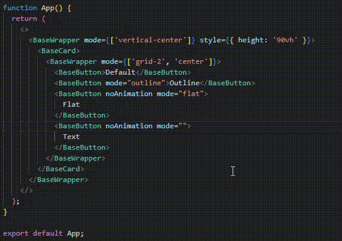

# Bınak React Components

A React UI component library for Bınak products.

## Components

- BaseButton
- BaseCard
- BaseErrorModal
- BaseInput
- BaseLink
- BaseLoading
- BaseModal
- BaseSpinner
- BaseWrapper
- BaseFormInput
- BaseFormItem

## Usage

Install binak-react-components with via your package manager:

```
npm i binak-react-components
```

Import the components you need and use:

```
import { BaseButton, BaseCard, BaseInput, BaseWrapper } from 'binak-react-components';
```



> [!IMPORTANT]
> While using form components, you should use register prop to pass [React Hook Form register method:](https://react-hook-form.com/docs/useform/register)

```javascript
<BaseCard>
  <form onSubmit={handleSubmit(onSubmit)}>
    <h2>{t('Create Link')}</h2>
    <BaseFormInput
      id="doorNumber"
      label={t('Door Number')}
      error={errors.doorNumber}
      register={register('doorNumber', {
        required: true,
        maxLength: 20,
      })}
      errorMessage={t('Please enter a valid door number')}
    />
    <BaseWrapper mode={['align-right']}>
      <BaseButton type="submit">{t('Create')}</BaseButton>
    </BaseWrapper>
  </form>
</BaseCard>
```

> [!WARNING]
> It is suggested to be used in apps which only created with Vite.

## Technologies Used

- React
- TypeScript
- Vite
- Framer Motion
- React Hook Form

[](http://binakybs.com)
