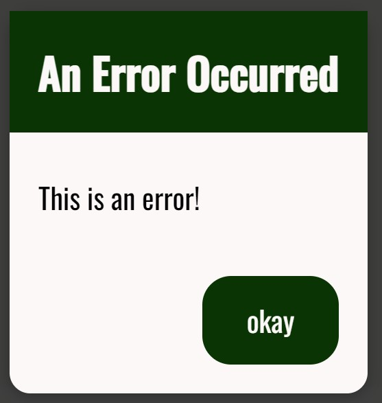

# BaseErrorModal

## Import

```jsx
import { BaseErrorModal } from 'binak-react-components';
```

## Props

|      Name      |               Type               |     Default Value     |
| :------------: | :------------------------------: | :-------------------: |
|   **error**    |             _string_             |      _undefined_      |
|   **errors**   |            _string[]_            |      _undefined_      |
| **okayButton** |             _string_             |         _''_          |
|   **title**    |             _string_             | _'An Error Occurred'_ |
|  **onClose**   |         _() => unknown_          |      _undefined_      |
|  **...props**  | _dialog props_ \| _BaseModal Props_ |          _-_          |

## Example

```jsx
const [error, setError] = useState('This is an error!');

return (
  <BaseErrorModal
    error={error}
    onClose={() => setError('')}
    okayButton="okay"
  />
);
```


