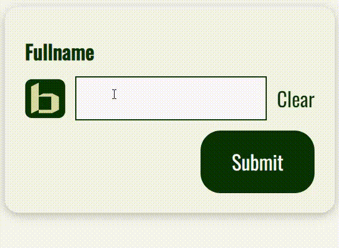

# BaseFormInput

## Import

```jsx
import { BaseFormInput } from 'binak-react-components';
import { useForm } from 'react-hook-form';
```

## Props

> :::important
> While using this component, you should use register prop to pass [React Hook Form register method:](https://react-hook-form.com/docs/useform/register)

> |           Name           |              Type               |                        Default Value                         |
> | :----------------------: | :-----------------------------: | :----------------------------------------------------------: |
> |          **id**          |            _string_             |                         _undefined_                          |
> |        **label**         |            _string_             |                         _undefined_                          |
> |    **labelPosition**     | _'left' \| 'center' \| 'right'_ |                           _'left'_                           |
> |       **register**       | _UseFormRegisterReturn\<any\>_  |                         _undefined_                          |
> |        **error**         |          _sFieldError_          |                         _undefined_                          |
> |     **errorMessage**     |            _string_             |                         _undefined_                          |
> |      **inputType**       |            _string_             |                         _undefined_                          |
> |    **childrenBefore**    |           _ReactNode_           |                         _undefined_                          |
> |    **childrenAfter**     |           _ReactNode_           |                         _undefined_                          |
> | **childrenWrapperStyle** |         _CSSProperties_         | _\{ display: 'flex', gap: '0.5rem', alignItems: 'center' \}_ |
> |       **...props**       |           _div props_           |                             _-_                              |

## Example

```jsx
const {
  register,
  handleSubmit,
  formState: { errors },
} = useForm < CreateLinkForm > { mode: 'onTouched' };

return (
  <BaseCard>
    <form onSubmit={handleSubmit((data) => alert(data.fullname))}>
      <BaseFormInput
        id="fullname"
        label={'Fullname'}
        error={errors.fullname}
        register={register('fullname', {
          required: true,
          maxLength: 30,
          minLength: 5,
        })}
        errorMessage={'Please enter a valid fullname!'}
        childrenBefore={
          
        }
        childrenAfter={
          <BaseButton mode="text" onClick={() => reset({ fullname: '' })}>
            Clear
          </BaseButton>
        }
      />
      <BaseWrapper mode={['align-right']}>
        <BaseButton type="submit">Submit</BaseButton>
      </BaseWrapper>
    </form>
  </BaseCard>
);
```


