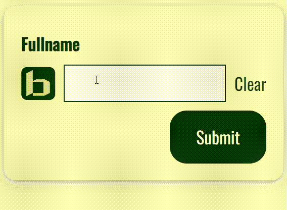

# BaseFormItem

## Import

```jsx
import { BaseFormItem } from 'binak-react-components';
```

## Props

|           Name           |              Type               |                        Default Value                         |
| :----------------------: | :-----------------------------: | :----------------------------------------------------------: |
|          **id**          |            _string_             |                         _undefined_                          |
|        **label**         |            _string_             |                         _undefined_                          |
|    **labelPosition**     | _'left' \| 'center' \| 'right'_ |                           _'left'_                           |
|        **error**         |          _sFieldError_          |                         _undefined_                          |
|     **errorMessage**     |            _string_             |                         _undefined_                          |
|       **children**       |           _ReactNode_           |                         _undefined_                          |
| **childrenWrapperStyle** |         _CSSProperties_         | _\{ display: 'flex', gap: '0.5rem', alignItems: 'center' \}_ |
|       **...props**       |           _div props_           |                             _-_                              |

## Example

```jsx
//import { useForm } from 'react-hook-form';
const {
  register,
  handleSubmit,
  formState: { errors },
} = useForm < CreateLinkForm > { mode: 'onTouched' };

return (
  <BaseCard>
    <form onSubmit={handleSubmit((data) => alert(data.fullname))}>
      <BaseFormItem
        id="fullname"
        label={'Fullname'}
        error={errors.fullname}
        errorMessage={'Please enter a valid fullname!'}
        childrenWrapperStyle={{
          display: 'flex',
          gap: '0.5rem',
          alignItems: 'center',
        }}
      >
        
        <BaseInput
          register={register('fullname', {
            required: true,
            maxLength: 30,
            minLength: 5,
          })}
        />
        <BaseButton mode="text" onClick={() => reset({ fullname: '' })}>
          Clear
        </BaseButton>
      </BaseFormItem>

      <BaseWrapper mode={['align-right']}>
        <BaseButton type="submit">Submit</BaseButton>
      </BaseWrapper>
    </form>
  </BaseCard>
);
```


