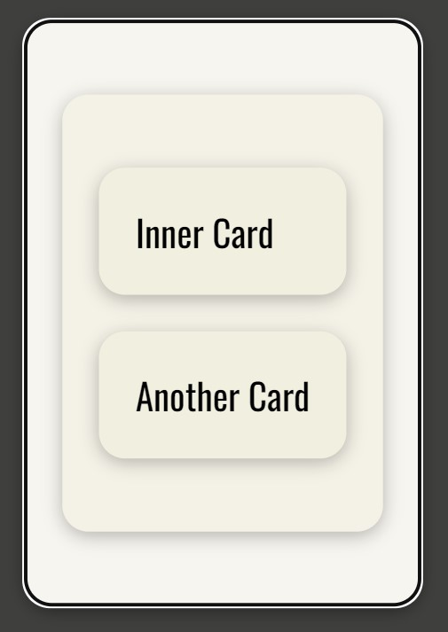
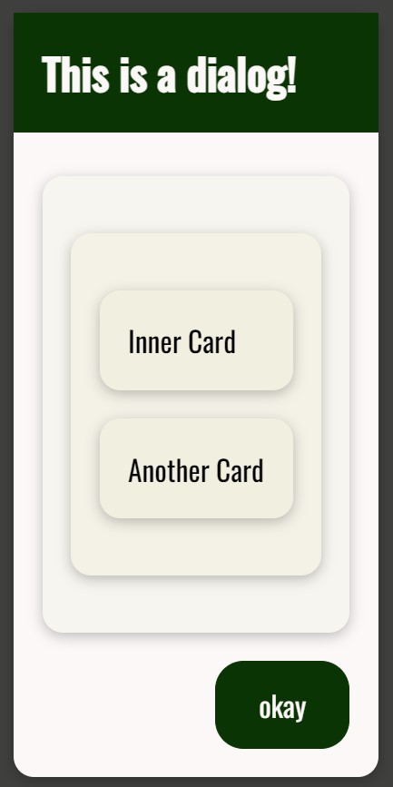

# BaseModal

## Import

```jsx
import { BaseModal } from 'binak-react-components';
```

## Props

|       Name        |      Type       | Default Value |
| :---------------: | :-------------: | :-----------: |
|     **open**      |    _boolean_    |  _undefined_  |
|   **children**    |   _ReactNode_   |  _undefined_  |
|    **onClose**    |   _() => any_   |  _undefined_  |
|    **center**     |    _boolean_    |  _undefined_  |
|     **title**     |    _string_     |  _undefined_  |
|    **content**    |   _ReactNode_   |  _undefined_  |
|  **baseDialog**   |    _boolean_    |  _undefined_  |
|  **okayButton**   |    _string_     |     _''_      |
|   **menuItems**   |   _ReactNode_   |  _undefined_  |
| **backdropStyle** | _CSSProperties_ |  _undefined_  |
|  **dialogStyle**  | _CSSProperties_ |  _undefined_  |
|   **...props**    | _dialog props_  |      _-_      |

## Example

```jsx
const [openModal, setOpenModal] = useState(true);
return (
  <BaseModal open={openModal} onClose={() => setOpenModal(false)}>
    {/* BaseCard */}
    <BaseCard style={{ margin: '0' }}>
      <BaseCard>
        <BaseCard>Inner Card</BaseCard>
        <BaseCard>Another Card</BaseCard>
      </BaseCard>
    </BaseCard>
  </BaseModal>
);
```



```jsx
const [openModal, setOpenModal] = useState(true);
return (
  <BaseModal
    open={openModal}
    onClose={() => setOpenModal(false)}
    baseDialog
    title="This is a dialog!"
    okayButton="okay"
  >
    <BaseCard style={{ margin: '0' }}>
      <BaseCard>
        <BaseCard>Inner Card</BaseCard>
        <BaseCard>Another Card</BaseCard>
      </BaseCard>
    </BaseCard>
  </BaseModal>
);
```


