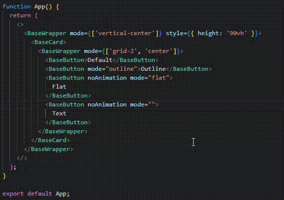

# Bınak React Components

A React UI component library for [Bınak](https://binakybs.com/) products.



## Usage

Install binak-react-components with via your package manager:

```
npm i binak-react-components
```

Import the components you need and use:

```
import { BaseButton, BaseCard, BaseInput, BaseWrapper } from 'binak-react-components';
```

## Components

- BaseButton
- BaseCard
- BaseErrorModal
- BaseFooter
- BaseFormInput
- BaseFormItem
- BaseHeader
- BaseInput
- BaseLoading
- BaseModal
- BaseSpinner
- BaseWrapper

> :::warning
> It is suggested to be used in apps which only created with Vite.

## Technologies Used

- React
- TypeScript
- Vite
- Framer Motion
- React Hook Form
- Usehooks-ts

[](http://binakybs.com)
