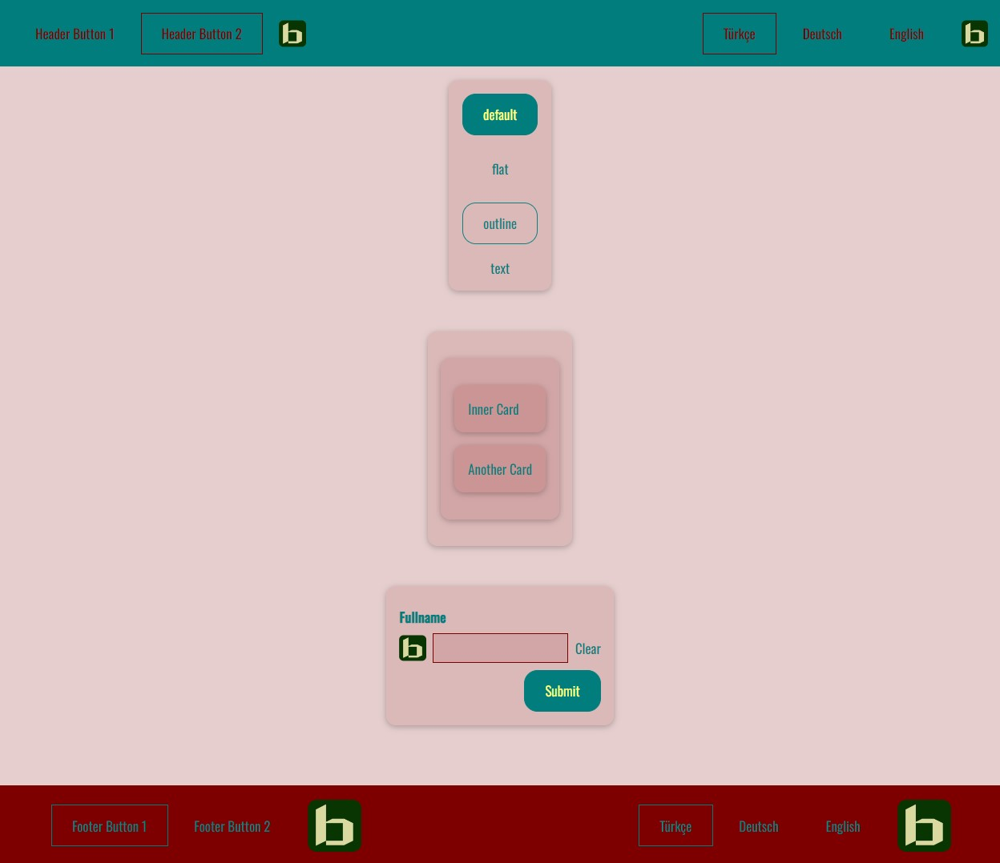

# Setting Own Colors

## Import

```jsx
import {
  setColor1,
  setColor2,
  setColor3,
  setColor4,
  setColor5,
} from "binak-react-components";
```

## Parameters

|   Name    |   Type   |            Description             |
| :-------: | :------: | :--------------------------------: |
|  **Red**  | _number_ |  _Red number value for RGB color_  |
| **Green** | _number_ | _Green number value for RGB color_ |
| **Blue**  | _number_ | _Blue number value for RGB color_  |

## Example

```jsx
setColor1(255, 255, 125);
setColor2(0, 125, 125);
setColor3(125, 0, 0);
setColor4(255, 0, 0);
setColor5(255, 0, 255);
```



:::caution
If you are using Next.js (especially with app router and SSR), make sure to call `setColorX` functions **inside a React event handler or a `useEffect` hook**.  
Calling them at the top-level (outside a function/component) will cause errors like `document is not defined` during server-side rendering.
:::
